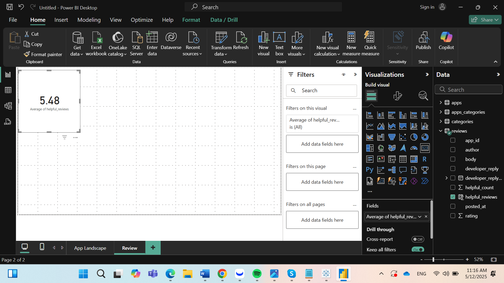
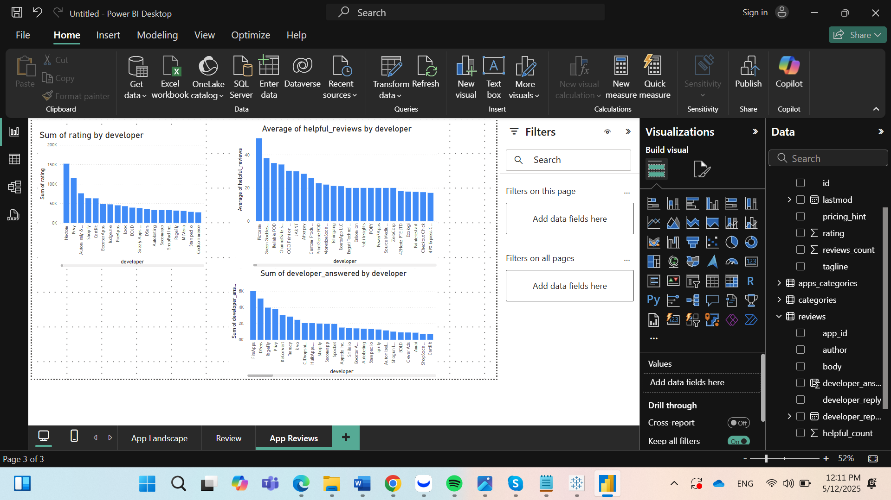
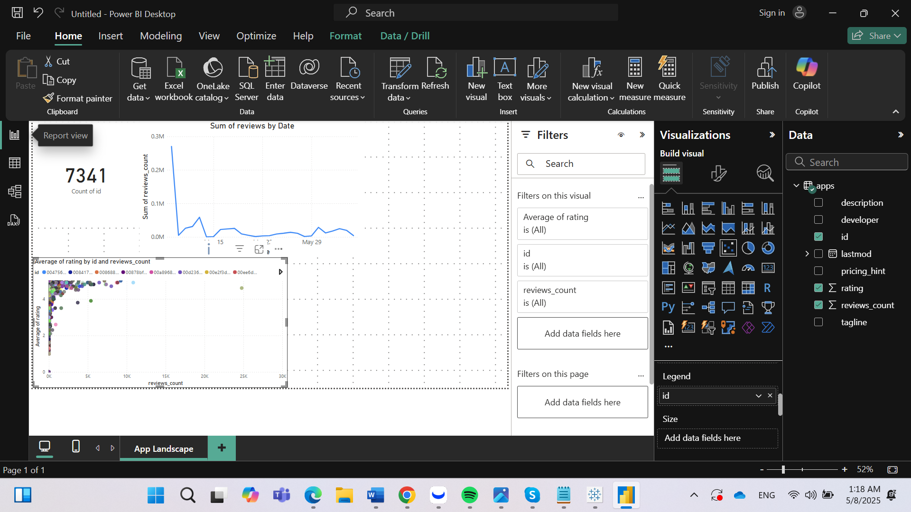

# 📊 Shopify App Reviews Dashboard - Power BI

Este proyecto presenta un análisis visual interactivo sobre las reseñas de aplicaciones en el ecosistema de Shopify. Se explora el comportamiento de los usuarios y desarrolladores a través de diferentes indicadores relacionados con ratings, reseñas útiles y respuestas.

---

## 📁 Dataset

- **Archivo fuente:** `shopify.xlsx`
- **Tablas utilizadas:** `apps`, `reviews`, `apps_categories`, `categories`

---

## 📊 Análisis: Reviews

En esta sección se muestran visualizaciones que permiten explorar la relación entre la calificación de las aplicaciones y la participación de los desarrolladores en las respuestas a las reseñas.

- Se creó una nueva métrica binaria para identificar si un desarrollador respondió o no a una reseña.
- Se presenta una tarjeta de KPI con el promedio de reseñas útiles (`helpful_reviews`).
- El gráfico de dispersión muestra que las apps con respuestas por parte del desarrollador tienden a tener una mejor calificación promedio.

📸 Imagen:  

---

## 📊 Análisis: App Reviews

Se analiza a fondo la actividad de los desarrolladores y su impacto en la experiencia de usuario.

- Se construyó un modelo relacional para conectar reseñas con las apps correspondientes.
- Se visualiza la suma total de calificaciones por desarrollador.
- Se identifica a los desarrolladores con mayor promedio de reseñas útiles.
- Se analizan los desarrolladores más receptivos con base en su número de respuestas, filtrando únicamente los casos con más de 500 reseñas.

📸 Imagen:  

---

## 📚 Insights destacados

- Los desarrolladores como **Shopify Inc.**, **Booster Apps** y **Avada** sobresalen por su alto volumen de calificaciones y participación activa.
- Un alto volumen de ratings no siempre refleja buena calidad: algunas apps tienen muchas reseñas pero de baja utilidad.
- El promedio de reseñas útiles es un mejor indicador de valor que la cantidad bruta de ratings.
- La respuesta activa de los desarrolladores se relaciona con mejores calificaciones.

---

## 📎 Recursos visuales anteriores

También se complementa con análisis del panorama general de apps en el App Store de Shopify.

📸 Imagen:  

---

## ✍️ Autor

Este proyecto fue desarrollado como ejercicio de análisis y visualización de datos con Power BI.

